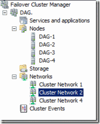

# Lightweight Static Blog Generator

A small Python script that converts markdown files with YAML front matter into a static blog suitable for GitHub Pages.

## Features

- One HTML page per markdown post
- Homepage with pagination
- Tag archive pages
- RSS feed generation (`rss.xml`)
- Previous/next links on each post page
- Homepage excerpts taken from the first paragraph of each post
- Copies `images/` and `assets/` into the published output if present
- No heavyweight static site generator required

## Expected markdown format

```md
---
title: "ExampleText"
date: 2024-10-19
tags:
  - "Exampletag"
---
Article Text

[](http://example.com/image.png)
```

## Project structure

```text
static_blog_generator/
├─ build.py
├─ template.html
├─ index_template.html
├─ style.css
├─ README.md
├─ content/
│  ├─ post1.md
│  ├─ post2.md
│  └─ ...
├─ images/
├─ assets/
└─ docs/
```

## Dependencies

Install the two required Python libraries:

```bash
pip install pyyaml markdown
```

## Configuration

Open `build.py` and update these values near the top:

```python
SITE_TITLE = "My Blog"
SITE_DESCRIPTION = "Static blog generated from markdown"
SITE_URL = "https://example.github.io/repository-name"
POSTS_PER_PAGE = 5
```

`SITE_URL` is especially important for correct RSS links.

## How to build the site

From the project folder:

```bash
python build.py
```

This generates the published site into:

```text
docs/
```

## How to preview locally

After building:

```bash
cd docs
python -m http.server 8000
```

Then open:

```text
http://localhost:8000
```

## GitHub Pages deployment

This project is already configured to publish into `docs/`, which is convenient for GitHub Pages.

### Option 1: Publish from `main` branch `/docs`

1. Push the project to GitHub
2. In the repository settings, open **Pages**
3. Set the source to:
   - **Branch:** `main`
   - **Folder:** `/docs`
4. Save

GitHub Pages will then serve the generated site.

### Suggested workflow

- Keep your markdown source in `content/`
- Run `python build.py` after adding or editing posts
- Commit both source changes and the regenerated `docs/`

## Notes on images

If your markdown references `images/...`, keep those files in the local `images/` folder next to `build.py`. They will be copied into the published site.

