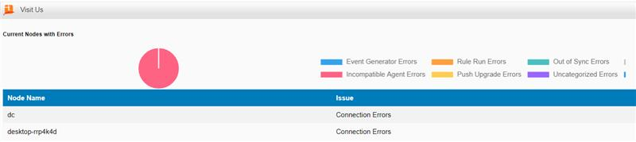

## Setup

[](https://nextnextnextfinished.wordpress.com/wp-content/uploads/2024/03/image.jpg)

Working with Tripwire Enterprise, it's often very useful to see how nodes are doing but reporting (other than as a big table set) can be difficult. So, this is a quick HTML report that shows nodes with errors in a graphical chart, reflecting the assetview/node tags and a table that links you to a node search for the node name. To use it you'll need to:

1\. Create a directory in

Tripwire\\TE\\Server\\data\\integrations

2\. Create a file called index.html file to the integrations folder from step 1 and add the following content:

```
<!DOCTYPE html><html>	<head>		<Title>Tripwire Enterprise Nodes with errors</Title>		<link rel="SHORTCUT ICON" href="/ci/favicon.ico">        <script>            mylocation=window.location.hostname        </script>        <script src="https://cdn.jsdelivr.net/npm/chart.js/dist/chart.umd.min.js"></script>        <!-- Usage        1. Create a directory in        Tripwire\TE\Server\data\integrations        2. Copy the files in this zip to the integrations folder        3. Edit the (Tripwire\TE\Server\data\config\Server.properties file and add the following  lines:          # Support for Professional Services Web Integration          tw.integrations.enabled=true          com.tripwire.space.core.homepage.visitus.url=/integrations/index.html        4. Save the changes        5. Restart the Tripwire Enterprise console server service        6. Login to Tripwire Enterprise, go to the Home Manager        7. Add the "Visit Us" Widget        The report should then be accessible via the menu on the widget        Notes:         * For graphical reports, please ensure you have internet access on the machine accessing the Tripwire webconsole or otherwise download and update the chart.js file to run "fully" offline        * If the page content doesn't load, please ensure you are logged into TE - refreshing the page will prompt for credentials if not logged in        -->        <style>                          body{                font-family: Roboto, Helvetica, sans-serif;                font-size: 12px;                margin-top: 0px;                margin-left: 0px;            }            .header{                background-color: rgb(0, 124, 187);                color: white;                padding: 5px;                padding-left: 10px;                width: 100%;                font-size: 28px;                font-weight: bold;            }            table{                border-collapse: collapse;                width: 100%;            }            td, th {                border: 0px solid #ddd;                padding: 8px;              }              tr:nth-child(even){background-color: #f2f2f2;}            tr:hover {background-color: #ddd;}            th {                padding-top: 12px;                padding-bottom: 12px;                text-align: left;                background-color: rgb(0, 124, 187);                color: white;              }            .content {                width: 100%;            }            a {                color: #FFFFFF;                text-decoration: none;            }        </style>	<meta charset="utf-8"/>    </head><body>    <div class="content" id="content">        <h5 id="ReportTitle">Current Nodes with Errors</a></h5>        <div style="position: relative; height:30vh; width:90vw"><canvas id="myChart"></canvas></div>    </div></body><script>// Get the Health System Tag ID, get the descendant node groups, then get the descendant node count for each operating system// Create a new table elementvar consoleIP = mylocationvar NodeGroupName = "Health"// Create the table elementconst table = document.createElement('table');// Set the title link to provide a "fullscreen" view$linktitle = document.getElementById("ReportTitle")$linktitle.innerHTML = "<a href='https://"+consoleIP+"/integrations/index.html' target='_blank' style='color:black'>Current Nodes with Errors</a>"// Create the table header row and cellsconst headerRow = table.createTHead().insertRow();const headerCell1 = headerRow.insertCell();headerCell1.innerHTML = 'Node Name';headerCell1.setAttribute('scope', 'col');headerCell1.setAttribute('style', 'font-weight:bold; background-color: rgb(0, 124, 187); color: white');const headerCell2 = headerRow.insertCell();headerCell2.innerHTML = 'Issue';headerCell2.setAttribute('scope', 'col');headerCell2.setAttribute('style', 'font-weight:bold; background-color: rgb(0, 124, 187); color: white');fetch('https://'+consoleIP+'/api/v1/nodes')  .then(response => response.json())  .then(nodes => {    // Filter nodes with tagset of "Health"    const operatingSystemNodes = nodes.filter(node => {      return node.tags.some(tag => tag.tagset === "Health");    });    // Add the table to the DOM    const boxWrapper = document.getElementById("content");    const container = document.createElement('div');        boxWrapper.appendChild(table);        boxWrapper.appendChild(container);    // Add data rows for each Connection Errors node    operatingSystemNodes.forEach(node => {      const row = table.insertRow();      const nodeNameCell = row.insertCell();      licUrl = "https://"+consoleIP+"/console/lic.search.cmd?lic=true&managerId=nodeManager&pageId=nodeManager.nodeFinderPage&searchCriteria=%7B%22search.node.name%22%3A%22"+node.name+"%22%2C%22search.node.severityRange.maxValue%22%3A%2210000%22%2C%22selectedSearchType%22%3A%22node%22%2C%22search.node.name.op%22%3A3%2C%22criteria.searchExecuted%22%3Atrue%2C%22search.node.severityRange.minValue%22%3A%220%22%7D"      nodeNameCell.innerHTML = "<a href="+licUrl+" style='color:black'>"+node.name+"</a>";      const operatingSystemCell = row.insertCell();      const operatingSystemTags = node.tags.filter(tag => tag.tagset === "Health");      const operatingSystems = operatingSystemTags.map(tag => tag.tag).join(", ");      operatingSystemCell.innerHTML = operatingSystems;    });  })  .catch(error => {    console.error(error);  });// Use the fetch API to get data and populate the graph  fetch('https://'+consoleIP+'/api/v1/nodegroups?name='+NodeGroupName)  .then(response => response.json())  .then(data => {    // get the child node groups    return fetch('https://'+consoleIP+'/api/v1/nodegroups/' + data[0].id + '/links')      .then(response => response.json())      .then(data => {        let promises = [];        let counts = {};        data.forEach(b => {          // get the descendant node count          const promise = fetch('https://'+consoleIP+'/api/v1/nodegroups/' + b.id + '/descendantNodes')            .then(response => response.json())            .then(descendantNodes => {              counts[b.name] = descendantNodes.length;            })            .catch(err => {              console.error(err);            });          promises.push(promise);        });        return Promise.all(promises)          .then(() => {            // Create the pie chart            const ctx = document.getElementById('myChart').getContext('2d');            const chart = new Chart(ctx, {              type: 'pie',              data: {                labels: Object.keys(counts),                datasets: [{                  data: Object.values(counts),                                  }]              },              options: {                plugins: {                    legend: {                        position: 'right',                    }                },                responsive: true,                maintainAspectRatio: false,                title :{                  display: true,                  text: 'Node Group Pie Chart'}              }            });          })          .catch(err => {            console.error(err);          });      })      .catch(err => {        console.error(err);      });  })  .catch(err => {    console.error(err);  });</script></html>
```

3\. Edit the Tripwire\\TE\\Server\\data\\config\\Server.properties file and add the following lines:  

> ```
> # Support for Professional Services Web Integrationtw.integrations.enabled=true com.tripwire.space.core.homepage.visitus.url=/integrations/tenodeerrorswidgetreport.html
> ```

4\. Save the changes

5\. Restart the Tripwire Enterprise console server service

6\. Login to Tripwire Enterprise, go to the Home Manager

7\. Add the "Visit Us" Widget - the report should then be accessible via the Homepage widget.

## Tips

- I'd recommend setting it on a Homepage pane that is one column to ensure you can see the chart legend)

- This code is pretty reusable - I have similar widgets to show break downs of systems by Operating System (try replacing "health" with Operating System for example)!

- For graphical reports, please ensure you have internet access on the machine accessing the Tripwire web-console or otherwise download and update the chart.js file to run "fully" offline

- Due to limitations on the sizing of the "visit us" widget which I've used to present the report, you may find it beneficial to click on the title ("Current Nodes with Errors") within the widget to see the full table set if you have more than a few nodes with errors!

- If the page content doesn't load, please ensure you are logged into TE - refresh the page will prompt for credentials if not logged in. It may also be slow if you have a LOT of nodes with errors 
