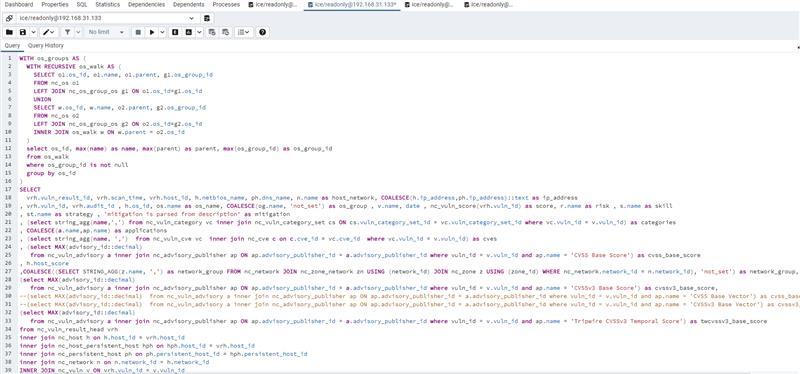
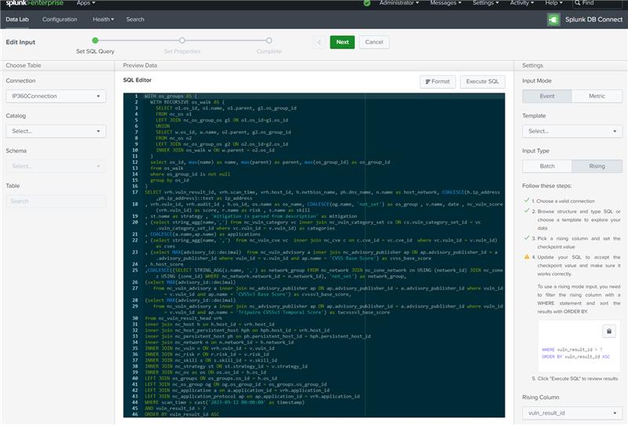
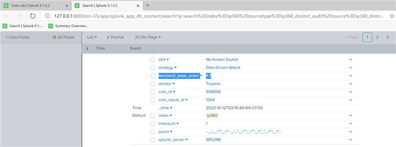
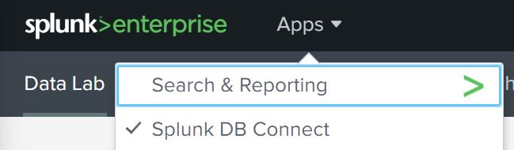
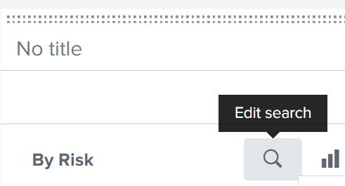

IP360's new Splunk app makes use of IP360's inbuilt postgres read only database access which means you can easily expand the data collected by Splunk if what's already pulled isn't quite what you need. Here's an example put together for a client recently:

- Identify the data you need
    - We don't publish a schema for IP360's DB (as far as I'm aware, but it's a pretty easy to understand database structure so a bit of exploration should be pretty easy). I'd suggest installing pgAdmin just to let you tweak the data you pull, though you can do testing within Splunk's DB Connect App itself (Apps > DB Connect > Data Lab and then edit the existing queries - we'll talk more about those in a moment). Bear in mind not all data is available via this method as we don't expose full ASPL data via the readonly DB. Still, you should be able to put something together easily enough:

[](https://nextnextnextfinished.wordpress.com/wp-content/uploads/2024/03/image.jpeg)

- Update/extend an existing query or set up a new one in Splunk
    - Once you've got your data, you can add it as a query to Splunk via Apps > DB Connect > Data Lab. In many cases, you can simply amend the existing query - in this case, if I want to add CVSS\_V3 scores I edited the distinct Audit query to include:  
        _(select MAX(advisory\_id::decimal)  from nc\_vuln\_advisory a inner join nc\_advisory\_publisher ap ON ap.advisory\_publisher\_id = a.advisory\_publisher\_id where vuln\_id = v.vuln\_id and ap.name = 'Tripwire CVSSv3 Temporal Score') as twcvssv3\_base\_score_

[](https://nextnextnextfinished.wordpress.com/wp-content/uploads/2024/03/image-1.jpeg)

- Test, test, test (and add in dashboards, etc if you wish)
    - To test, the easiest way to run your query is to go back to the Inputs section of the data lab and simply click Find Events (bear in mind the data set is, by default, only pulled every 30 minutes (1800secs)):

[](https://nextnextnextfinished.wordpress.com/wp-content/uploads/2024/03/image-2.jpeg)

Here's the final query if others find it of interest/use:

```
WITH os_groups AS (  WITH RECURSIVE os_walk AS (    SELECT o1.os_id, o1.name, o1.parent, g1.os_group_id    FROM nc_os o1    LEFT JOIN nc_os_group_os g1 ON o1.os_id=g1.os_id    UNION    SELECT w.os_id, w.name, o2.parent, g2.os_group_id    FROM nc_os o2    LEFT JOIN nc_os_group_os g2 ON o2.os_id=g2.os_id    INNER JOIN os_walk w ON w.parent = o2.os_id  )  select os_id, max(name) as name, max(parent) as parent, max(os_group_id) as os_group_id  from os_walk  where os_group_id is not null  group by os_id) SELECT vrh.vuln_result_id, vrh.scan_time, vrh.host_id, h.netbios_name, ph.dns_name, n.name as host_network, COALESCE(h.ip_address,ph.ip_address)::text as ip_address, vrh.vuln_id, vrh.audit_id , h.os_id, os.name as os_name, COALESCE(og.name, 'not_set') as os_group , v.name, date , nc_vuln_score(vrh.vuln_id) as score, r.name as risk , s.name as skill, st.name as strategy , 'mitigation is parsed from description' as mitigation, (select string_agg(name,',') from nc_vuln_category vc inner join nc_vuln_category_set cs ON cs.vuln_category_set_id = vc.vuln_category_set_id where vc.vuln_id = v.vuln_id) as categories, COALESCE(a.name,ap.name) as applications, (select string_agg(name, ',')  from nc_vuln_cve vc  inner join nc_cve c on c.cve_id = vc.cve_id  where vc.vuln_id = v.vuln_id) as cves, (select MAX(advisory_id::decimal)  from nc_vuln_advisory a inner join nc_advisory_publisher ap ON ap.advisory_publisher_id = a.advisory_publisher_id where vuln_id = v.vuln_id and ap.name = 'CVSS Base Score') as cvss_base_score, h.host_score,COALESCE((SELECT STRING_AGG(z.name, ',') as network_group FROM nc_network JOIN nc_zone_network zn USING (network_id) JOIN nc_zone z USING (zone_id) WHERE nc_network.network_id = n.network_id), 'not_set') as network_group,(select MAX(advisory_id::decimal)     from nc_vuln_advisory a inner join nc_advisory_publisher ap ON ap.advisory_publisher_id = a.advisory_publisher_id where vuln_id = v.vuln_id and ap.name = 'CVSSv3 Base Score') as cvssv3_base_score,  (select MAX(advisory_id::decimal)     from nc_vuln_advisory a inner join nc_advisory_publisher ap ON ap.advisory_publisher_id = a.advisory_publisher_id where vuln_id = v.vuln_id and ap.name = 'Tripwire CVSSv3 Temporal Score') as twcvssv3_temporal_scorefrom nc_vuln_result_head vrh inner join nc_host h on h.host_id = vrh.host_id inner join nc_host_persistent_host hph on hph.host_id = vrh.host_idinner join nc_persistent_host ph on ph.persistent_host_id = hph.persistent_host_id inner join nc_network n on n.network_id = h.network_idINNER JOIN nc_vuln v ON vrh.vuln_id = v.vuln_id INNER JOIN nc_risk r ON r.risk_id = v.risk_id INNER JOIN nc_skill s ON s.skill_id = v.skill_id INNER JOIN nc_strategy st ON st.strategy_id = v.strategy_id INNER JOIN nc_os as os ON os.os_id = h.os_id LEFT JOIN os_groups ON os_groups.os_id = h.os_idLEFT JOIN nc_os_group og ON og.os_group_id = os_groups.os_group_idLEFT JOIN nc_application a on a.application_id = vrh.application_idLEFT JOIN nc_application_protocol ap on ap.application_id = vrh.application_idWHERE scan_time > cast('2023-09-12 00:00:00' as timestamp)ORDER BY vuln_result_id ASC
```

Usage:

- Log in to Splunk with administrative access

- Go to Apps > Splunk DB Connect

[](https://nextnextnextfinished.wordpress.com/wp-content/uploads/2024/03/image-3.jpeg)

- Go to Data Lab > Inputs (if not there by default) and click on the IP360 Distinct Audit query input (ip360\_disintct\_audit\_dbx3)

- In the query editor, amend the query to use the updated query (see above)

- Click on Execute Query to confirm the query (it may not pull back any new results if the query has ran recently/already got the latest results from IP360).

- Click Next and (you may also optionally temporarily change the frequency with which the query is ran to speed up testing on this page before) click Finish

- You can test this easily enough from the same Data Lab > Inputs page by doing a search... from which you should be able to spot the new fields once data has been pulled in

If you need to update the dashboards, you can simply go to the dashboard(s) you wish to update and replace (or add in) the new fields (i.e. "cvssv3\_base\_score" or "twcvssv3\_temporal\_score")- i.e. 

- Go to the Dashboard you wish to update and click on Edit on the button toolbar

- On the relevant widget(s), click on the spyglass/search icon and click to edit the search

[](https://nextnextnextfinished.wordpress.com/wp-content/uploads/2024/03/image-3-1.jpeg)

- Update the field to the new value 

- You may also go to Edit Source and do a find and replace for the old "cvss\_base\_score" field and replace with the new one you wish (though this may not work in all cases so take care if doing so and save the XML before editing!) 

That's it - bear in mind HISTORICAL data won't have the new fields - but new results will (this is to preserve data integrity)
